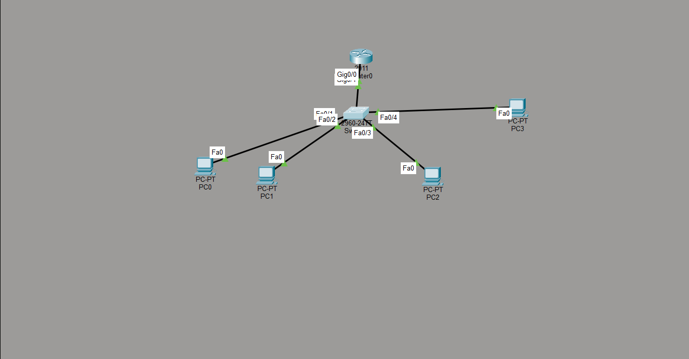
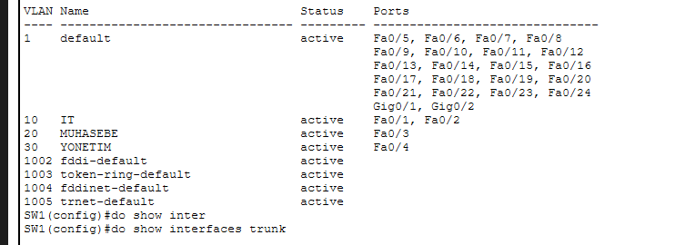
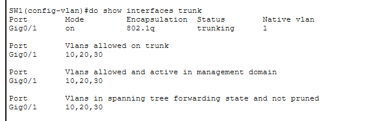
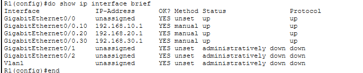
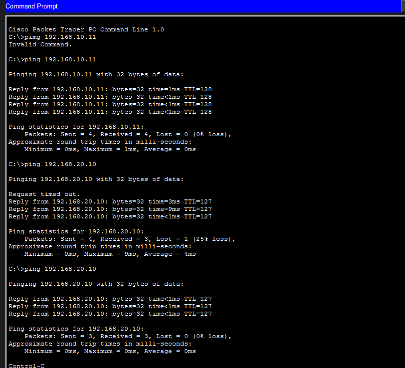

# VLAN & Inter-VLAN Routing Lab

Bu lab çalışmasında Cisco Packet Tracer üzerinde VLAN yapılandırması ve farklı VLAN'lar arasında haberleşme sağlamak için Router-on-a-Stick yöntemi uygulanmıştır.

## Amaç

Bu çalışmanın amacı; VLAN mantığını, switch portlarının VLAN'lara atanmasını, trunk port yapılandırmasını ve router sub-interface kullanarak Inter-VLAN Routing işlemini öğrenmektir.

## Kullanılan Araçlar

- Cisco Packet Tracer
- 1 Router
- 1 Switch
- 4 PC
- VLAN
- Trunk Port
- Router-on-a-Stick
- Ping testi

## Ağ Yapısı

| VLAN | Bölüm | Cihazlar | Network | Gateway |
|---|---|---|---|---|
| VLAN 10 | IT | PC0, PC1 | 192.168.10.0/24 | 192.168.10.1 |
| VLAN 20 | Muhasebe | PC2 | 192.168.20.0/24 | 192.168.20.1 |
| VLAN 30 | Yönetim | PC3 | 192.168.30.0/24 | 192.168.30.1 |

## IP Planı

| Cihaz | VLAN | IP Adresi | Subnet Mask | Default Gateway |
|---|---|---|---|---|
| PC0 | VLAN 10 | 192.168.10.10 | 255.255.255.0 | 192.168.10.1 |
| PC1 | VLAN 10 | 192.168.10.11 | 255.255.255.0 | 192.168.10.1 |
| PC2 | VLAN 20 | 192.168.20.10 | 255.255.255.0 | 192.168.20.1 |
| PC3 | VLAN 30 | 192.168.30.10 | 255.255.255.0 | 192.168.30.1 |

## Yapılan İşlemler

- Switch üzerinde VLAN 10, VLAN 20 ve VLAN 30 oluşturuldu.
- PC portları ilgili VLAN'lara atandı.
- Router'a bağlı switch portu trunk olarak yapılandırıldı.
- Router üzerinde VLAN'lar için sub-interface yapılandırması yapıldı.
- Her VLAN için ayrı default gateway adresi tanımlandı.
- Aynı VLAN ve farklı VLAN'lar arasında ping testi yapıldı.

## Test Sonuçları

PC0 üzerinden PC1'e ping atılarak aynı VLAN içerisindeki bağlantı test edilmiştir.

```bash
ping 192.168.10.11
```

PC0 üzerinden PC2'ye ping atılarak VLAN 10'dan VLAN 20'ye Inter-VLAN Routing testi yapılmıştır.

```bash
ping 192.168.20.10
```

İlk ping denemesinde ARP çözümlemesi nedeniyle bir paket kaybı görülmüş, sonraki testte bağlantının başarılı olduğu doğrulanmıştır.

## Komut Dosyaları

Switch ve router üzerinde kullanılan temel komutlar `configs` klasörü altında tutulmuştur.

- [switch-config.txt](configs/switch-config.txt)
- [router-config.txt](configs/router-config.txt)

## Ekran Görüntüleri

### Topoloji



### VLAN Listesi



### Trunk Kontrolü



### Router Interface Kontrolü



### Ping Testi



## Not

Bu lab çalışması, temel network bilgilerini geliştirmek ve VLAN/Inter-VLAN Routing konularını uygulamalı olarak öğrenmek amacıyla hazırlanmıştır.
